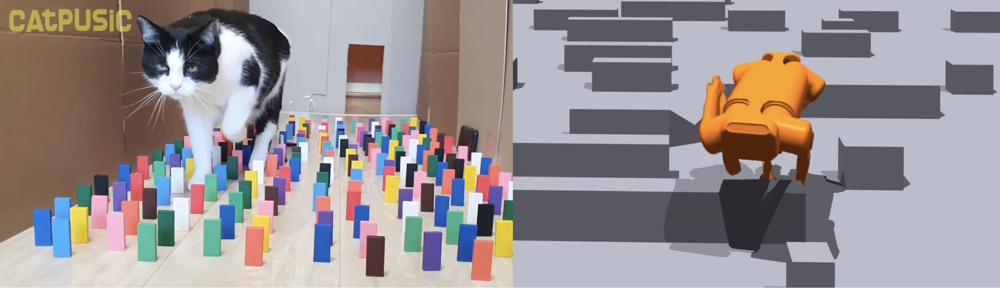

# ViNL: Visual Navigation and Locomotion over Obstacles
Code for our paper [ViNL: Visual Navigation and Locomotion over Obstacles](https://arxiv.org/abs/2210.14791).  [Project Page](http://www.joannetruong.com/projects/vinl.html)

Simar Kareer*, Naoki Yokoyama*, Dhruv Batra, Sehoon Ha, Joanne Truong

## What is ViNL


Ever notice how cats can navigate while skillfully stepping over obstacles?

We were inspired to make robots do the same!

ViNL consists of:

(1) a visual navigation policy that outputs velocity commands towards a goal coordinate in unfamiliar indoor environments (trained in Habitat);
and 

(2) a visual locomotion policy that controls the robot’s joints to follow the velocity commands while stepping over obstacles (trained in Isaac)

## Installation
### Easy Version
Clone this repo and submodules
`git clone --recurse-submodules git@github.com:SimarKareer/ViNL.git`

1. Run `setup.sh`.  You can just copy paste the contents into your terminal.  This will take around 10 minutes.
2. Locate your env and run `export LD_LIBRARY_PATH=/path/to/conda/envs/vinl/lib`.  `which python` can help you locate it.
3. Test your installation by running `python legged_gym/scripts/play.py --task=aliengo_nav --episode_id=-10`

### Hard Version
If that doesn't work here are some manual instructions

Install Isaac Gym (Instructions from [legged_gym](https://leggedrobotics.github.io/legged_gym/)).  Put it in `/submodules`
   - Download and install Isaac Gym Preview 3 (Preview 2 will not work!) from https://developer.nvidia.com/isaac-gym
   - `cd isaacgym/python && pip install -e .`
   - Try running an example `cd examples && python 1080_balls_of_solitude.py`
   - For troubleshooting check docs `isaacgym/docs/index.html`)

Install all submodules via 
`cd submodules/isaacgym/python pip install -e .`
`cd submodules/rsl_rl pip install -e .`
`cd submodules/habitat-lab pip install -e .`

Install `requirements.txt` for each submodule and main repo.
<!-- Put a set of models on google drive for evaluation -->

## Code Structure
- root
    - The root folder is a fork of [legged_gym](https://leggedrobotics.github.io/legged_gym/)
    - This contains all the code necessary to train locomotion policies.
    - `legged_gym/envs/base/legged_robot.py`: defines base legged robot tasks.
    - `legged_gym/envs/aliengo/aliengo.py`: defines robot and camera positions
    - `legged_gym/envs/base/legged_robot_config.py`: configuration for a legged robot task, inherited by other tasks like `aliengo_rough_config.py` or `aliengo_obs_config.py`
    - `python legged_gym/scripts/train.py --task=<aliengo_rough | aliengo_obs>`
    - `python legged_gym/scripts/lbc.py`: for final phase of training
    - `python legged_gym/scripts/play.py --task=<aliengo_rough | aliengo_obs | aliengo_lbc | aliengo_nav>`: play works for all phases of training
    - `legged_gym/utils/terrain.py`: defines the map, which includes spawning obstacles and walls.  Wall locations are defined in `resources/maps`
- `submodules/habitat-lab`: Fork of [habitat-lab](https://github.com/facebookresearch/habitat-lab).  Contains code for training visual navigation policy in habitat, using photorealistic 3d scans.
- `submodules/rsl_rl`
    - Fork of [rsl_rl](https://github.com/leggedrobotics/rsl_rl).
    - Our modifications allow for [Learning by Cheating](https://arxiv.org/abs/1912.12294) style training.  We use this to recreate privileged terrain information via egocentric vision.


- submodules/rsl_rl: fork of rsl_rl

## Full Training Procedure
Training occurs in stages.  At each stage we include the checkpoint of the previous stage to continue training.

1. Train a general purpose rough terrain walking policy (with privileged terrain info) `python legged_gym/scripts/train.py --task=aliengo_rough`
2. Train a obstacle orriented walking policy (with privileged terrain info) `python legged_gym/scripts/train.py --task=aliengo_obs`
3. Train a obstacle orriented walking policy (no privileged info terrain info).  This phase of training uses vision instead of a terrain map. `python legged_gym/scripts/train.py --task=aliengo_lbc`
4. Train a navigation policy in habitat-sim
<!-- Add link to checkpoint for each stage of training. -->

To invidually evalauate any of these policies run `python legged_gym/scripts/play.py --task=<task here>`.

## Evaluation
To evaluate each part of our approach 1-3 one can run `python legged_gym/scripts/play.py --task=<task here>`.  Be sure to first edit the `resume_path` parameter in the approriate config first though.  As an example, here's how to evaluate (1)

In `aliengo_rough_config.py` set `resume_path="weights/rough.pt"` and run `python legged_gym/scripts/play.py --task=aliengo_rough`

Once you have a locomotion policy (3) and navigation policy (4) you can evaluate our full approach (ViNL) with:
`python legged_gym/scripts/play.py --task=aliengo_nav --map=<optionally specify a floorplan>`
We provide a number of floorplans in `resources/maps`

Helpful Tips:
- You can set `RECORD_FRAMES=True` in `legged_gym/scripts/play.py` to record an episode to visually inspect.  You can convert the folder of images into a video via `ffmpeg -framerate 50 -pattern_type glob -i '*.png' -frames:v 9999 -c:v libx264 -pix_fmt yuv420p <videoName>.mp4`

## Acknowledgements
This repo is forked from legged gym.  We rely on [rsl_rl](https://github.com/leggedrobotics/rsl_rl) for rl algorithm implementation and isaacgym as our simulator.  For information about how to add new tasks, robots, etc see [legged_gym](https://leggedrobotics.github.io/legged_gym/)

## Citation
```
@inproceedings{kareer2022vinl,
    title={ViNL: Visual Navigation and Locomotion Over Obstacles}, 
    author={Simar Kareer and Naoki Yokoyama and Dhruv Batra and Sehoon Ha and Joanne Truong}, 
    journal={arXiv preprint arXiv:2210.14791},
    year={2022}
}
```
